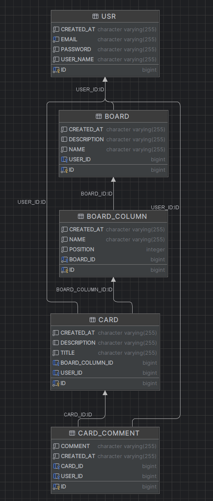

# ФТ

##  Аутентификация
- **Регистрация** (email, имя, пароль)
-  **Вход в систему** (Spring Security Form Login)
-  **Выход** (Logout, сброс сессии)

##  Доски
-  **CRUD досок** (создание, чтение, обновление, удаление)
-  **Список досок** (на главной, только свои)
-  **Приватность** (доступ только владельцу, 403 на чужие по URL)
-  **Шаринг** (приглашение других пользователей)

##  Колонки
-  **CRUD колонок** внутри доски
-  **Отображение** (горизонтальный список)
-  **Каскадное удаление** (колонка тянет за собой карточки)

##  Карточки
-  **CRUD карточек** (заголовок, описание)
-  **Детальный просмотр** (модалка или отдельная страница)
-  **Перемещение** (Drag & Drop между колонками) - **опционально**
-  **Отображение метаданных** (автор, дата, кол-во комментов)

##  Комментарии
-  **Добавление** текстового комментария
-  **Просмотр** (хронология, автор, дата)
-  **Удаление** (только свои собственные)

---
# НФТ:
> Архитектура, стек, безопасность.

- **Стек:** Java 17, Spring Boot 3, Thymeleaf, Tailwind CSS

- **БД:** H2/PostgreSQL

-  **Безопасность:** BCrypt для паролей, CSRF-токены в Thymeleaf-формах

-  **UI/UX:** Адаптивная верстка (Tailwind grid/flex)

- **Валидация:** Jakarta Validation (`@Valid`) на сервере
-  **Производительность:** Рендеринг страницы < 2 сек - **Опционально**

# Проектирование логической модели

## Таблицы

### 👤 USR (Пользователи)
| Поле | Тип | Описание | Ограничения |
|------|-----|----------|-------------|
| `id` | BIGINT | Уникальный ID | **PK**, AUTO_INCREMENT |
| `email` | VARCHAR(255) | Email | NOT NULL, UNIQUE |
| `name` | VARCHAR(100) | Имя | NOT NULL |
| `password_hash` | VARCHAR(255) | Хэш пароля (BCrypt) | NOT NULL |
| `created_at` | TIMESTAMP | Дата регистрации | NOT NULL |

---

### BOARD (Доски)
| Поле | Тип | Описание | Ограничения |
|------|-----|----------|-------------|
| `id` | BIGINT | Уникальный ID | **PK**, AUTO_INCREMENT |
| `user_id` | BIGINT | Владелец | **FK → USR(id)**, NOT NULL |
| `name` | VARCHAR(100) | Название | NOT NULL |
| `description` | TEXT | Описание | - |
| `created_at` | TIMESTAMP | Дата создания | NOT NULL |

---

###  BOARD_COLUMN (Колонки)
| Поле | Тип | Описание | Ограничения |
|------|-----|----------|-------------|
| `id` | BIGINT | Уникальный ID | **PK**, AUTO_INCREMENT |
| `board_id` | BIGINT | Привязка к доске | **FK → BOARD(id)**, NOT NULL |
| `name` | VARCHAR(50) | Название | NOT NULL |
| `position` | INT | Порядок | NOT NULL |
| `created_at` | TIMESTAMP | Дата создания | NOT NULL |

---

### CARD (Карточки)
| Поле | Тип | Описание | Ограничения |
|------|-----|----------|-------------|
| `id` | BIGINT | Уникальный ID | **PK**, AUTO_INCREMENT |
| `column_id` | BIGINT | Привязка к колонке | **FK → BOARD_COLUMN(id)**, NOT NULL |
| `user_id` | BIGINT | Автор | **FK → USR(id)**, NOT NULL |
| `title` | VARCHAR(100) | Заголовок | NOT NULL |
| `description` | TEXT | Описание | - |
| `created_at` | TIMESTAMP | Дата создания | NOT NULL |

---

### CARD_COMMENT (Комментарии)
| Поле | Тип | Описание | Ограничения |
|------|-----|----------|-------------|
| `id` | BIGINT | Уникальный ID | **PK**, AUTO_INCREMENT |
| `card_id` | BIGINT | Привязка к карточке | **FK → CARD(id)**, NOT NULL |
| `user_id` | BIGINT | Автор | **FK → USR(id)**, NOT NULL |
| `content` | TEXT | Текст | NOT NULL |
| `created_at` | TIMESTAMP | Дата создания | NOT NULL |

---

